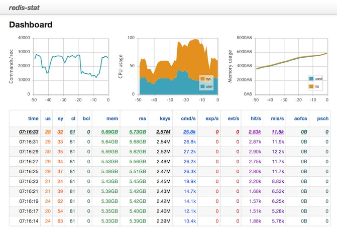

#6.1.9 可视化监控

[redis-stat](https://github.com/junegunn/redis-stat) 是一个简单易用的 redis 监控工具。它利用 redis 的 info 命令收集数据并展示到 web 页面。可以通过 ```gem install redis-stat``` 命令完成安装，或者使用 [docker ](https://github.com/morfeo8marc/redis-stat-docker) 安装。redis-stat监控效果图：


