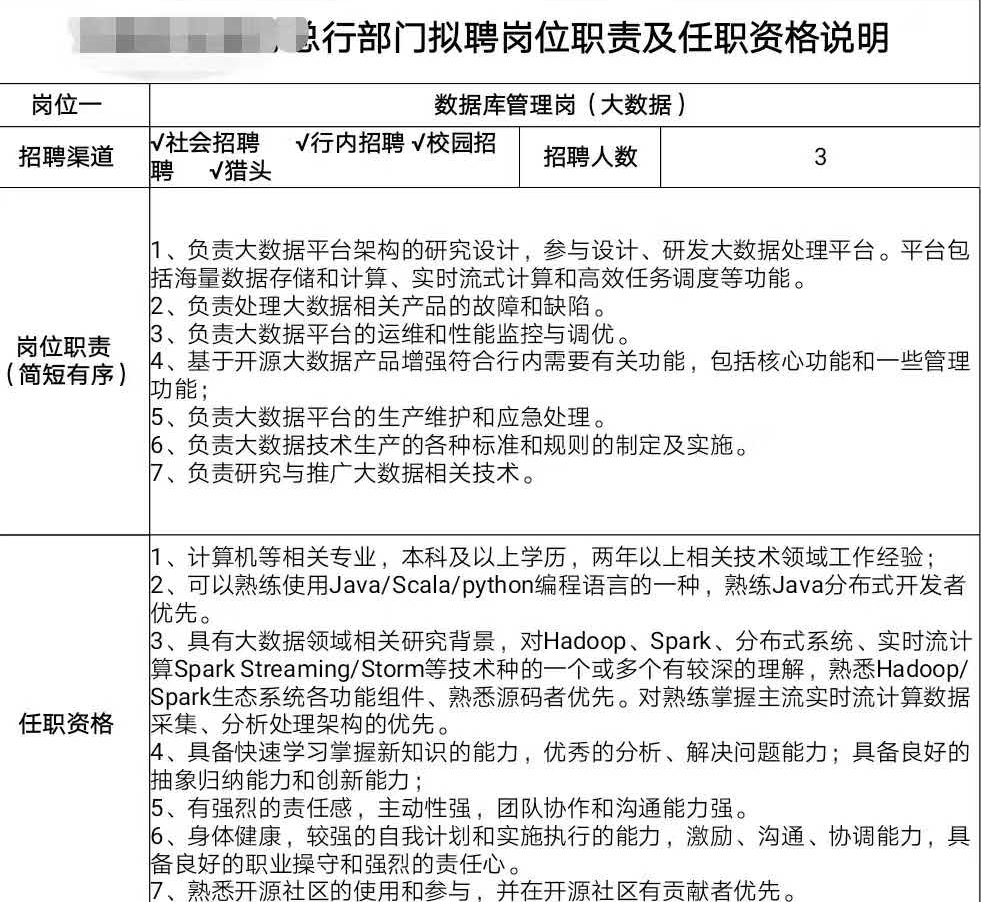

# Redis开发运维实践指南

本手册是我在一家中国大陆的中型商业银行做大数据系统工程师中进行的总结归纳，包含开发和运维的各方面的使用、应用场景和最佳实践，以及各个高可用架构的搭建和测试。

下载和线上阅读最新版请访问：[https://www.gitbook.com/book/gnuhpc/redis-all-about/details](https://www.gitbook.com/book/gnuhpc/redis-all-about/details)

我会定期持续更新此指南，以供各位了解认识redis。

其中会有引用的各种文献和图片，我会尽可能的标注引用，如果您发现您的文字或者图片未标注引用，请fork本手册的github并pull request：
[https://github.com/gnuhpc/All-About-Redis](https://github.com/gnuhpc/All-About-Redis)

本手册符合共同创作协议, 协议文本见 [http://creativecommons.net.cn/licenses/meet-the-licenses/](http://creativecommons.net.cn/licenses/meet-the-licenses/)

有不正确的地方，请通过gnuhpc@weixin或者huangpengcheng#cmbc.com.cn (:s/#/@)联系我。

如果你觉得这些内容有帮助，欢迎Star我，也欢迎打赏 ^_^ ，我会不定期公布支持我的好朋友名单。

— Pengcheng Huang
## **新书发布：** ##
 
我和Airbnb美国的工程师王左非一起写的新书Redis 4.x Cookbook已经由Packt出版，目前在Amazon.com上销售，请大家多多支持！
https://www.amazon.com/Redis-4-X-Cookbook-Pengcheng-Huang/dp/1783988169/ref=sr_1_2?ie=UTF8&qid=1519899713&sr=8-2&keywords=redis&dpID=51x10vJb%252B6L&preST=_SX218_BO1,204,203,200_QL40_&dpSrc=srch
 
亚马逊中国Kindle版地址：
https://www.amazon.cn/dp/B07B6SDXQH/ref=sr_1_2?ie=UTF8&qid=1522737150&sr=8-2&keywords=redis+cookbook
 
中文版正在翻译，将在博文视点出版。
 
## **技术交流：** ##
谢谢大家的赞助，我建立了一个Redis技术交流微信群（主群已满，有目前codis、pika、tidb等知名开源软件的作者），专门交流Redis开发和运维相关技术的，由于已经超100人，想加入的请先加我的微信：gnuhpc。谢谢！

## **技术交流记录：** ##
为了上述Redis技术交流群，我还创建了一个知识星球，您可以使用微信扫描下列二维码进入，免费

## **长期招聘：** ##
我现在所在团队负责我行全行大数据基础架构平台和产品的建设和维护工作，待遇大于等于一线互联网，技术实力银行业大数据基础架构前三名，较之同规模的互联网团队也有技术特点。

坐标：北京市顺义区（公司有市内多趟班车来往，开车反方向无压力，团队崇尚任务驱动型，基本不加班）。

欢迎期待工作生活平衡又希望技术上有所精进的同学联系，有意者请发简历至 gnuhpc@foxmail.com 或加微信gnuhpc，具体要求如下：

## **赞助名单（由于微信面对面收钱无法显示，停止更新）：** ##

1. Tina 10元 2016-01-13
2. FloydZhang 10元 2016-01-15
3. Sammy-lp 16.8元 2016-01-21
4. Yunwei 10.1元 2016-01-25 
5. csyangchsh 15元 2016-01-29
6. 黄海斌 10元 2016-04-04 
7. Ghost 16.88元 2016-04-13
8. zbdba 18.8元 2016-04-19
9. 慎独 10元 2016-04-19
10. Truman 18.8元 2016-04-20
11. 蓝金伟 8.8元 2016-04-26
12. Mengjie 18.8元 2016-04-26
13. Jason Young 66元 2016-04-26

.......

微信二维码：

支付宝二维码：

 

